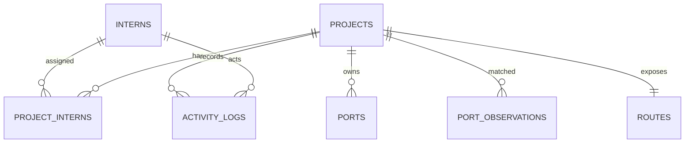

# PortD Database Schema

This document describes the current SQLite schema. Read it before you add a
query, service, or migration.

**Entity map**



**Tables**

| Table | Purpose | Key fields |
| --- | --- | --- |
| `interns` | Stores intern profiles. | `id`, required `full_name`, optional unique `email` and `identifier`, `active` |
| `projects` | Stores project setup and runtime state. | Unique `slug`, `directory`, `startup_command`, run flags, lifecycle, route sync status, timestamps |
| `project_interns` | Links projects to one or more interns. | Composite key: `project_id`, `intern_id` |
| `ports` | Reserves host ports for projects. | `port` is the global primary key. `role` is `main` or `internal` |
| `port_observations` | Caches host port discovery results. | Port number, optional process data, optional matched project, `observed_at` |
| `activity_logs` | Records safe audit events. | Optional actor, event and entity data, `outcome`, detail, timestamp |
| `routes` | Stores the desired Caddy proxy state. | One route per project, public path, upstream main port, provider ID, sync state |

**Rules enforced by SQLite**

- An intern must have a full name. Email and identifier can be empty for a
  legacy import, but each value must be unique when present.
- A project slug is unique. Store a URL-safe slug, not a display name.
- A project can have many interns. The same intern can join many projects.
- A port number can belong to only one project. Valid values are `1` through
  `65535`.
- Each project can have at most one port with role `main`.
- Project deletion removes its assignments and reserved ports.
- Intern deletion is blocked while an assignment exists.
- Deleting a project keeps its observations and clears their project link.
- Activity actors and entity links are nullable so history survives deletion.
- A project has at most one route. Deleting the project deletes its route.
- A route targets a reserved port. The service must ensure that port is the
  project's `main` port.

The database does not enforce that every project has a main port. The project
service must create at least one port and exactly one `main` port in one
transaction. It must also prevent changes that leave a project without a main
port.

**State fields**

`lifecycle_status` uses `draft`, `ready`, `running`, `stopped`, `failed`, or
`archived`. `route_sync_status` uses `pending`, `synced`, `failed`, or
`disabled`. The service must update these fields with `updated_at`.

`should_run` means PortD should try to start the project after startup.
`is_live` records the current runtime result. These flags are not a substitute
for a process check.

**Migration and query workflow**

The source schema is [000001_initial_schema.up.sql](../internal/db/migrations/000001_initial_schema.up.sql).
Use the matching down file only for local rollback. Apply migrations with:

```sh
just migrate-up
```

Keep SQL queries in `internal/db/queries`. Regenerate typed Go code with:

```sh
just generate
```

Use UTC timestamps and stable text IDs. Do not hand-write SQL in handlers.
Enable SQLite foreign keys on every application connection. Migration-time
`PRAGMA foreign_keys` does not configure later connections.
